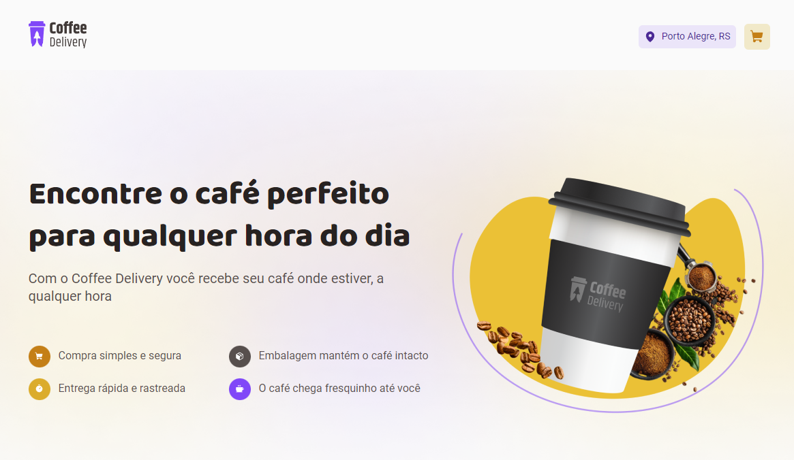

<h1 align="center">
  Ignite Coffe Delivery
</h1>

  <a href="#-layout">Layout</a>&nbsp;&nbsp;&nbsp;|&nbsp;&nbsp;&nbsp;
  <a href="#-projeto">Projeto</a>&nbsp;&nbsp;&nbsp;|&nbsp;&nbsp;&nbsp;
  <a href="#-tecnologias">Tecnologias</a>&nbsp;&nbsp;&nbsp;|&nbsp;&nbsp;&nbsp;    
  <a href="#memo-licença">Licença</a>

 

  

## 💻 Projeto

O Ignite Coffee Delivery é uma aplicação que simula um e-commerce especializado em vendas de café. A aplicação inclui as seguintes páginas:

- Cabeçalho: exibe o logotipo e o botão do carrinho, que mostra a quantidade de produtos no carrinho.
- Página inicial: apresenta uma descrição do site, um banner e uma lista de cafés disponíveis. Também permite adicionar cafés ao carrinho.
- Carrinho: página de finalização do pedido, onde há um formulário integrado a uma API de consulta de CEP. Ao inserir um CEP válido, o formulário é preenchido automaticamente. Além disso, o formulário é validado usando a biblioteca ZOD, integrada ao React Hook Form.
- Sucesso: página exibida após a confirmação do pedido.

Este projeto foi um desafio do módulo "Criando SPAs" da trilha de ReactJS do curso Ignite da Rocketseat. O objetivo principal era construir uma aplicação completa, incorporando conceitos importantes do ecossistema React aprendidos durante o módulo, como ContextAPI, useReducer, immer, styled-components, entre outros.

## 🚀 Tecnologias

Esse projeto foi desenvolvido com as seguintes tecnologias:

- Reactjs
- Vite
- Typescript
- ContextApi
- Styled Components
- Immer
- Reducer

## 📝 Licença

Esse projeto está sob a licença MIT. Veja o arquivo [LICENSE](LICENSE.md) para mais detalhes.

---
